<h1 align="center">FH6 Vinyl Group Editor</h1>

  <strong>A standalone desktop vinyl group editor for Forza Horizon 6.</strong>

  <a href="README.md">中文</a> ·
  <a href="README.en.md">English</a>

  <code>v1.0.0</code> · <code>Windows</code> · <code>Forza Horizon 6</code> · <code>Single EXE</code> · <code>5 Languages</code>

A local **SVG vector editor** built specifically for the **Forza Horizon vinyl / livery** workflow.
It exists to work around FH6's clumsy in-game editor and replace it with a proper desktop-class tool.
With FH6 Vinyl Group Editor you can do high-precision layout, tracing and layer management like a designer — then inject the result into your game save.

**Electron + vanilla JavaScript** (no frontend framework). UI available in **Chinese / Traditional Chinese / English / Japanese / Korean**.

## Key Features

- **Accurately recreated symbol library** — the editor ships with a precise symbol set containing all **1400 base geometric shapes** from Forza Horizon 6.
- **Vinyl group import / export** — export editable SVGs from FH6 saves. *(Only groups you created yourself can be exported.)*
- **Full vector editing** — selection, colouring, scaling, rotation, skew, opacity and layer ordering, with a feel that matches Forza Horizon 6 — plus a large set of exclusive features FH6 does not have, to make creating easier.
- **Built for tracing** — drop a high-res PNG/JPG underneath the canvas and trace over it. The injection tool automatically filters out reference layers; you can adjust background / layer opacity at any time and use the built-in colour picker.
- **Keyboard shortcuts partly matching Forza Horizon 6**, with full custom rebinding.
- **Save work session** — save your session and pick up exactly where you left off next time.
- **Restore work session** — roll back to an earlier auto-saved session after an unexpected interruption.
- Built on the core of **Inkscape2Forza** by F3ankk, with additional optimisations.

## Launch the Tool

Download the latest `FH6 Vinyl Group Editor.exe` from the **Releases** page and double-click to run.

**Nothing to install** — the EXE bundles everything it needs (Chromium + Node runtime).
On Windows 10/11 just double-click it; no Node.js, Python or any other dependency required.

> You only need Node.js 18+ (22 recommended) if you want to **run from source or build it yourself**.
> Normal users only need the EXE.

## Workflow Guide

### 1. Canvas & Editing

On the home screen, click **New** to open a blank editing canvas. The vinyl shapes are on the right — drag one onto the canvas to use it.

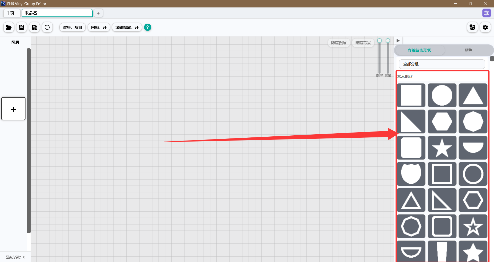

Click a layer to select it, or press `Enter`, to reveal the action bar.

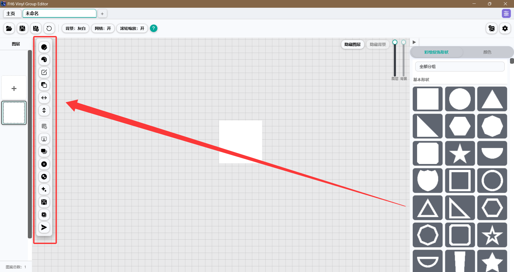

For every other button, find the **?** button in the app and **right-click** it (right-click! right-click!! right-click!!!) to enter help mode, then click whichever button you want explained — the layer panel on the left and the canvas itself are both clickable. **Left-clicking** the **?** button shows the shortcut list instead.

<table>
  <tr>
    <td align="center" width="50%">
      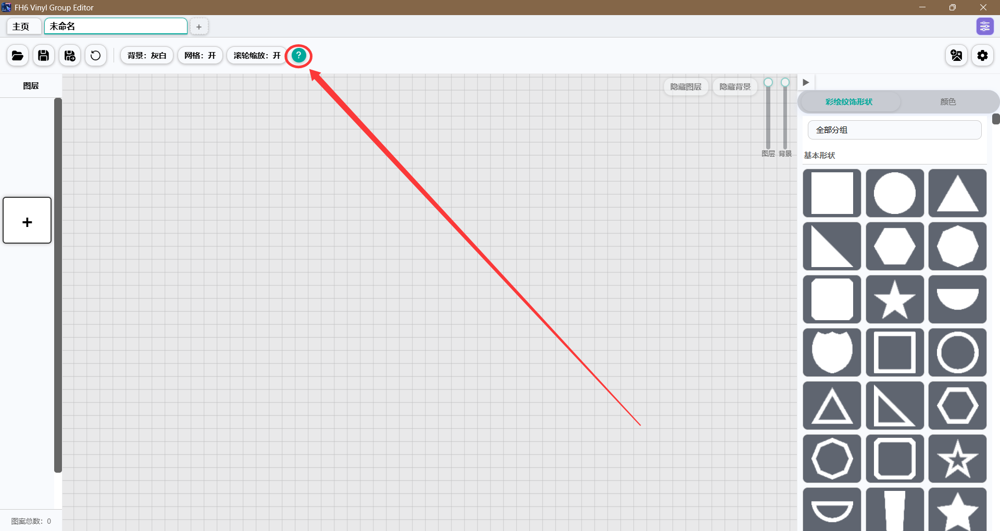 
      <strong>Right-click "?" to enter help mode</strong>
    </td>
    <td align="center" width="50%">
      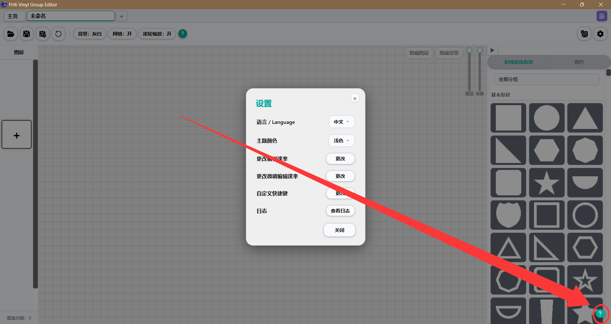 
      <strong>Right-click "?" to enter help mode</strong>
    </td>
  </tr>
  <tr>
    <td align="center" width="50%">
      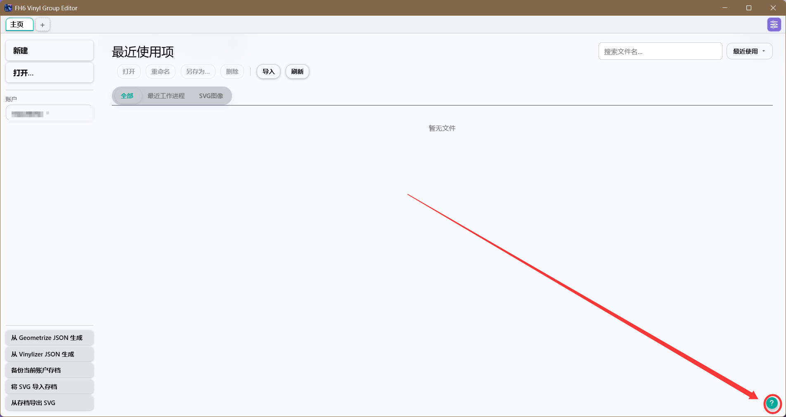 
      <strong>Right-click "?" to enter help mode</strong>
    </td>
  </tr>
</table>

### 2. Layer System

**Right-click** the **?** button in the app, then click the left layer panel, the action bar, or the canvas to see what each part does.

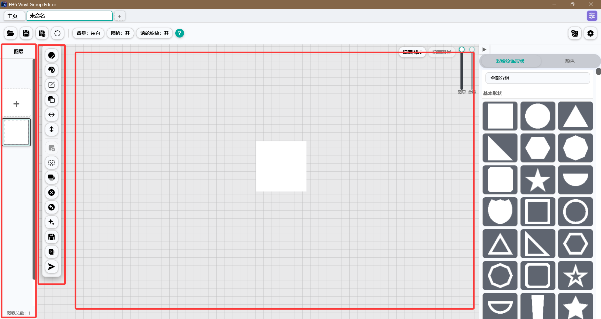

### 3. Layer Editing

Enter a layer's editing mode from the left action bar, by selecting a layer and double-pressing `Enter`, or by double-clicking the layer.
Left-click / right-click the **?** button in the app for details.

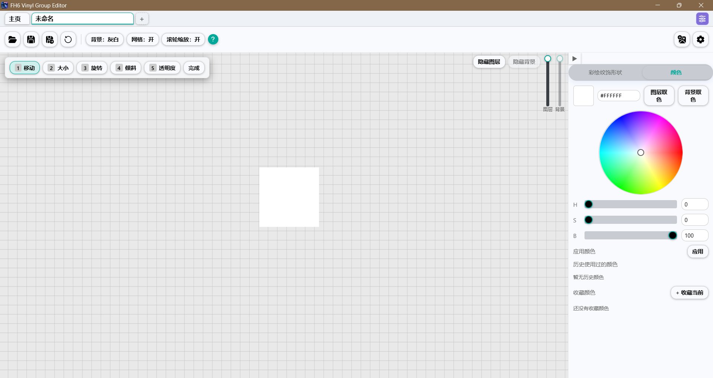

### 4. Tracing with Reference Images

Drag a photo, an illustration or a logo (PNG/JPG) into FH6 Vinyl Group Editor to use as a reference layer.
Anything that is not a library symbol is ignored on import and **never written into the game save**.

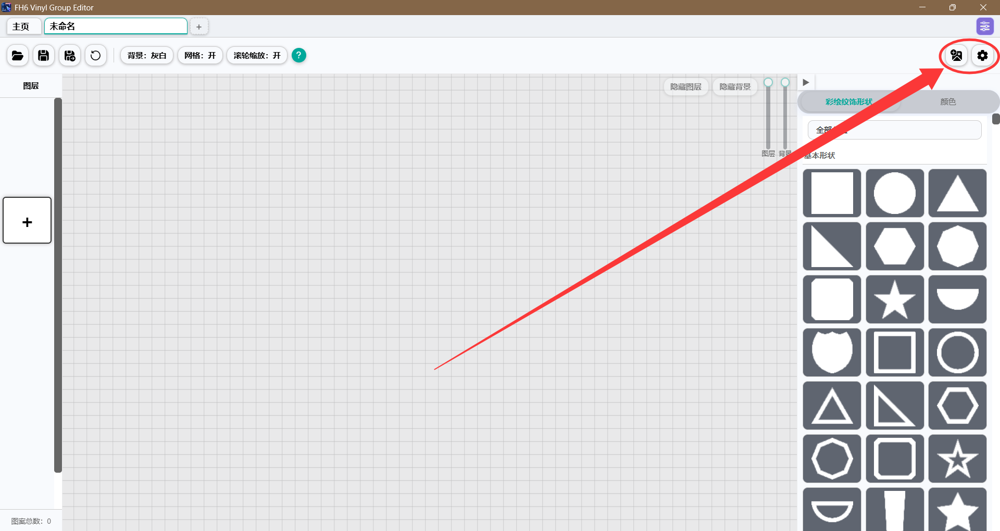

### 5. Work Sessions

- **`.svework` session files** — store your artwork, background image and colour history together, so you can resume exactly where you stopped.
- **Auto-save** — a history session is saved every 10 minutes, up to 20 kept, so you can roll back after an accident.

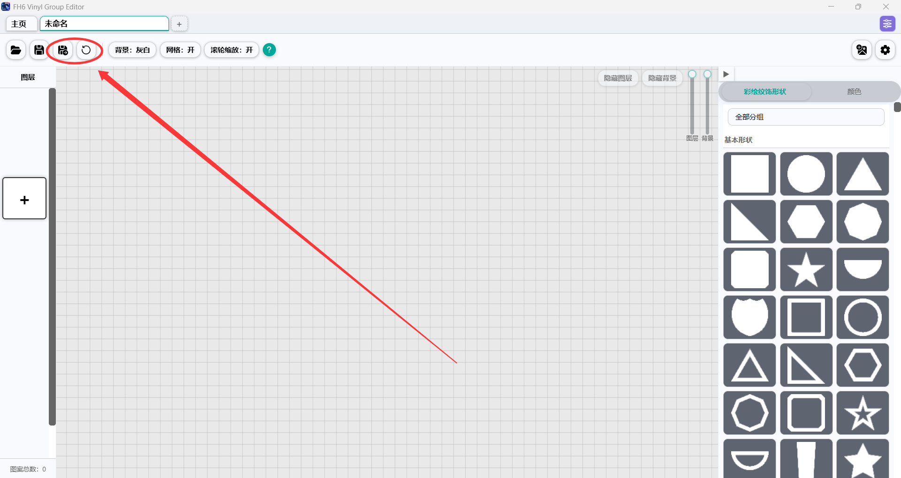

## Save Injection & In-Game Refresh

Once your artwork is finished, follow these steps to inject it into your game save:

**1. Prepare a placeholder in-game**
Open the FH6 vinyl group editor and create or select any group (an FH6 group needs at least 2 shapes). The target group no longer needs the same number of layers as your SVG, and placeholders no longer need to be white circles — any colour, any shape, and any existing layer count are accepted.

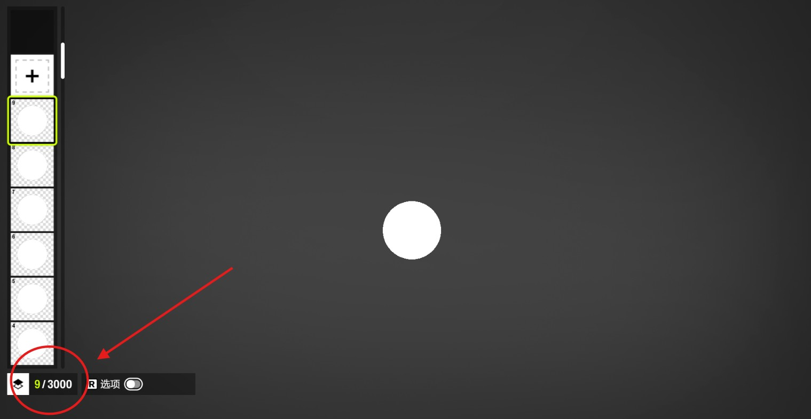

**2. Save the placeholder**
Give it a short, memorable name and make sure sharing is set to **private** (exit while you are still on the sharing page), then leave the vinyl group editor. You do not have to quit the game, but it is best to exit the editor.

**3. Locate the save directory**
First make sure you are working on the **right save**. Most people log in with a single account and have only one save — but if you play for someone else, or keep an alt account, there can be several FH6 saves on the same PC. Check carefully before continuing. Then choose **"Import SVG into save"**:

<table>
  <tr>
    <td align="center" width="50%">
      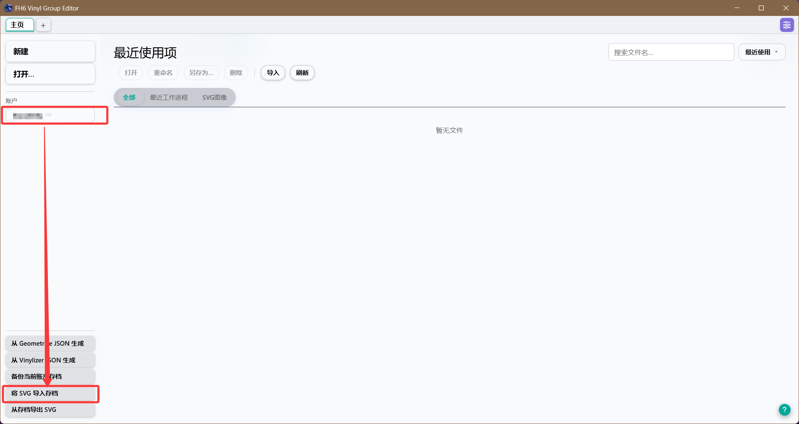 
      <strong>Import SVG into save</strong>
    </td>
    <td align="center" width="50%">
      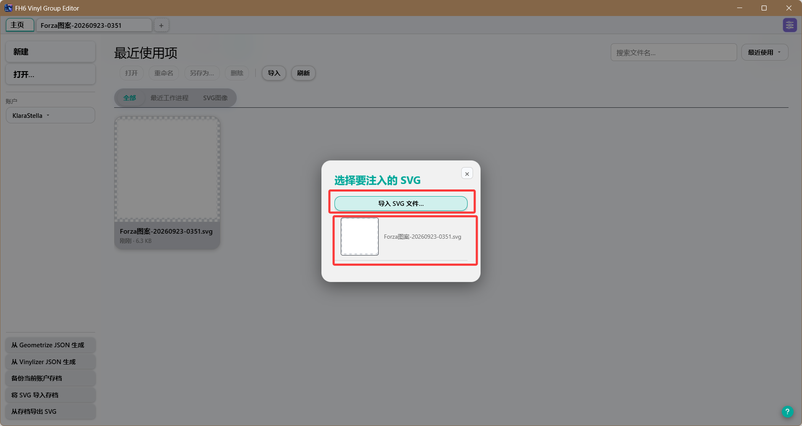 
      <strong>Pick the SVG you just saved / import the SVG file</strong>
    </td>
  </tr>
  <tr>
    <td align="center" width="50%">
      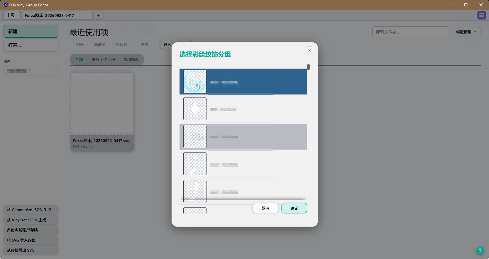 
      <strong>Then pick the vinyl group in that save to import into</strong>
    </td>
  </tr>
</table>

**4. Refresh in-game (optional)**
After a successful injection, go back into the game, open that group and re-save over it to refresh the cache and thumbnail.

## Generating SVG templates from Geometrize / Vinylizer JSON

The app can build an SVG file from JSON exported by **Geometrize** (forza-painter-fh6) and **Vinylizer**. To build one from Vinylizer JSON, choose **"Generate SVG from Vinylizer JSON"**.

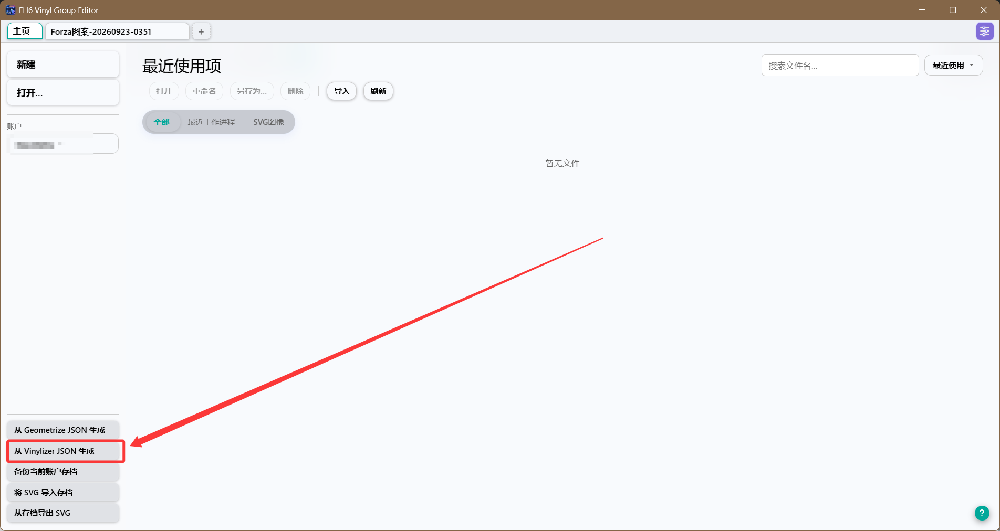

In testing, Vinylizer often optimises some layers down to fully transparent. Those layers are a complete waste of layer slots in a vinyl group, so this tool offers an **opacity threshold** when generating an SVG from Vinylizer JSON: layers whose opacity is less than or equal to the threshold are skipped on import.

Skipping semi-transparent layers can affect the visual result, and raising the threshold to 2-5 does not actually save many more layers — so under normal circumstances, or if you are not sure what you are doing, **leave this value at 0**. The tool will then only filter out fully transparent layers.

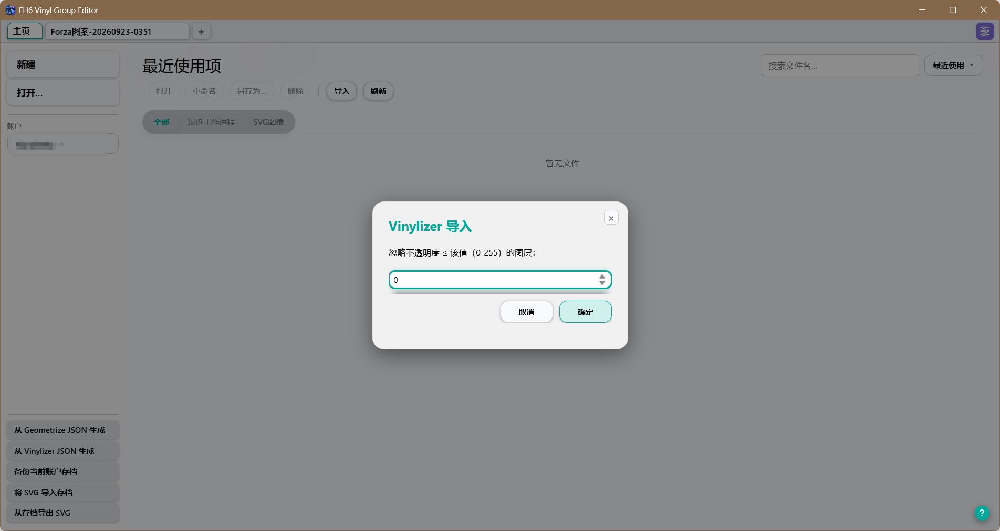

## What's New

### v1.2.0

- Added group inner editing feature
- Expanded themes from 2 to 8 palettes, with custom theme support

### v1.1.0

- Optimized the UI
- Optimized some features
- Added batch save injection and save export features

## Acknowledgements

This project's inspiration and its understanding of the underlying resource structure come entirely from the **Inkscape2Forza** project.

Thanks to **F3ankk** for help with the tricky parts of this project.

Sincere thanks to the original author and the open-source community.

## Disclaimer

Please read the following carefully. **Using this tool means you accept all risks:**

- **Hobby project** — this is a hobby project and may contain unknown bugs; updates are not guaranteed.
- **Account risk warning** — modifying local save files violates Microsoft / Xbox / FH6 terms of service and may result in account suspension or hardware bans. The author assumes no responsibility.
